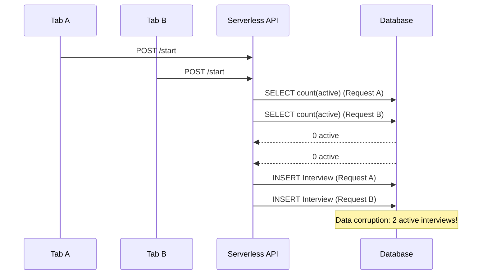
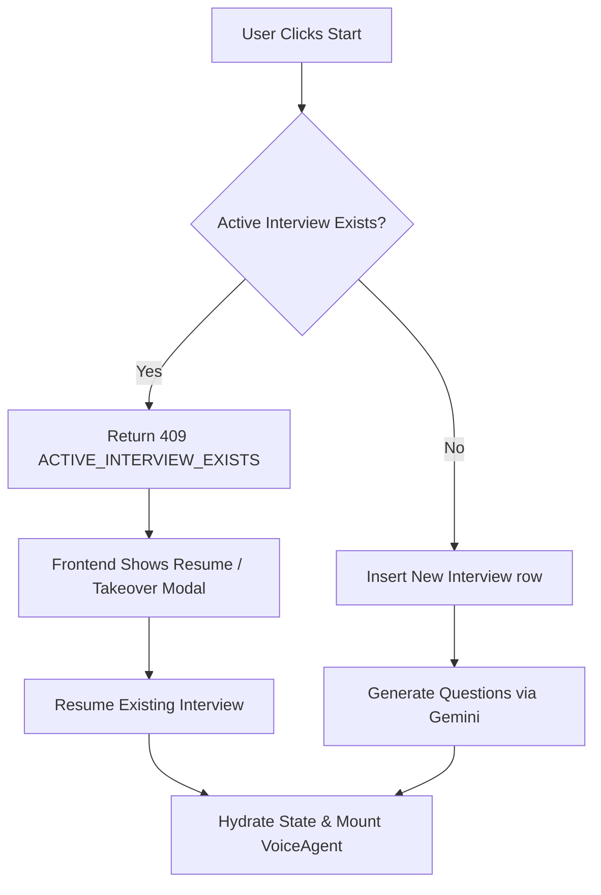
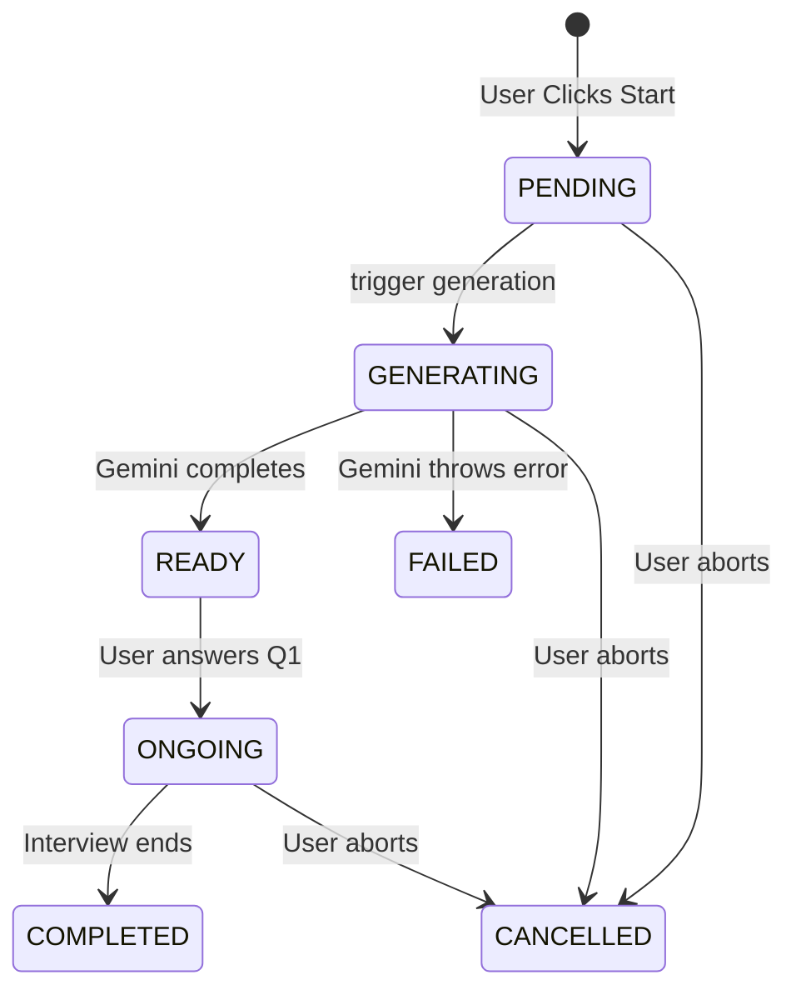

# One Active Interview Per User: Architecture Document

## Overview

In AI-driven platforms, stateful and long-running processes—such as real-time voice interviews—are notoriously vulnerable to concurrency issues. This document outlines the architecture, design decisions, and engineering solutions implemented to guarantee **One Active Interview Per User** within the Clutchly platform.

### Why this problem exists
AI interview platforms rely on orchestration across multiple heavy asynchronous services: Large Language Models (Gemini for question generation), real-time WebSockets (Deepgram for STT/TTS), and vector memory graphs (Cognee). Because these processes span several network hops and long durations, ensuring deterministic state management is inherently difficult.

### Why concurrent interview creation is dangerous
Without strict idempotency and concurrency guards, a user can effortlessly trigger race conditions (via double-clicking, browser refreshes, or opening multiple tabs) that cause the backend to spin up multiple overlapping AI sessions. 

### Credit Wastage
Duplicate AI calls are devastating to unit economics:
- **Gemini**: 2x token costs for generating redundant question sets.
- **Deepgram**: 2x live audio streaming costs for concurrent Ghost WebSockets.
- **Cognee**: Duplicate vector embeddings and graph traversals.

### The Production Imperative
Preventing duplicate sessions isn't just about saving money; it is a critical requirement for a stable production system. Without it, users experience chaotic audio overlaps, race conditions corrupt the PostgreSQL database, and AI evaluators hallucinate grading based on fragmented transcripts.

---

## Problem Statement

Before the architecture overhaul, the application was vulnerable to severe concurrency bugs. 

**Scenarios that broke the system:**
1. **Two Browser Tabs:** A user opens the dashboard in Tab A and Tab B, clicking "Start" in both. Both tabs mount voice agents, connecting to Deepgram twice.
2. **Double Click:** Fast-clicking the "Start" button triggers duplicate `POST /api/interview/start` API calls.
3. **Network Retry:** A slow mobile connection causes the browser to retry the start request automatically.
4. **Multiple Devices:** Starting an interview on a laptop, walking away, and starting a new one on a phone.

**What happened before the fix:**
- The database created multiple overlapping `Interview` rows.
- The `questionGenerator.service.ts` fired multiple parallel requests to Gemini.
- Deepgram initiated multiple real-time WebSocket streams, causing the AI to speak over itself.
- Final evaluations generated duplicate `Report` rows, corrupting analytics.

---

## Root Cause Analysis

The core of the vulnerability was a **Time Of Check to Time Of Use (TOCTOU)** flaw coupled with a lack of distributed locking.

1. **TOCTOU:** The backend validated if a user had an active interview by querying the database, but it did not hold a lock. If two requests arrived milliseconds apart, both queried the DB, both saw 0 active interviews, and both proceeded to create one.
2. **Serverless Execution:** In an Edge/Serverless environment (like Vercel), in-memory deduplication Maps (e.g., `withInFlight`) are empty across different Lambda instances. Thus, memory-based concurrency guards completely fail under load.
3. **Frontend Blindness:** React `useState` and frontend validation cannot prevent race conditions if the user opens a second tab or bypasses the UI altogether.

### Sequence Diagram: The TOCTOU Race Condition



---

## Solution Architecture

To guarantee absolute uniqueness, we implemented a multi-layered architecture enforcing idempotency from the React UI down to the PostgreSQL row-level locks.

1. **Atomic Interview Creation**: The `POST /api/interview/start` route now uses a strict `active` count check inside an interactive `$transaction`.
2. **Frontend Conflict Handling**: If the API returns `409 Conflict`, the frontend intercepts it and presents a takeover modal.
3. **State Restoration**: Instead of generating a new interview, navigating to the interview page automatically fetches the active session, reconstructs the Zustand store, and resumes exactly where the user left off.
4. **WebSocket Eviction**: The UI utilizes the `BroadcastChannel` API and cross-device polling to immediately sever ghost WebSocket connections when a new device claims ownership.



---

## Database Design

**No Schema Redesign Required:** We achieved strict concurrency control without overhauling the database schema or introducing Redis.

Instead of creating complex locking tables, we leveraged the existing `Interview` table's `status` enum:
- `PENDING`: Initializing.
- `GENERATING`: LLM is building the syllabus.
- `READY`: LLM finished, waiting for the user to speak.
- `ONGOING`: User is actively speaking.
- `COMPLETED`, `FAILED`, `CANCELLED`: Terminal states (Non-resumable).

**Why this design?**
By relying on PostgreSQL's atomic updates (e.g., `updateMany` where `status = FAILED`) and explicit `FOR UPDATE` row locks, we achieved ACID-compliant concurrency control without adding new infrastructure dependencies.

---

## Backend Changes

### 1. `app/api/interview/start/route.ts`
- **Purpose**: Mint a new interview session.
- **Important Logic**: Throws a custom `ActiveInterviewError` (HTTP 409) if an active session exists. This prevents the initial duplicate creation.

### 2. `services/answer.service.ts`
- **Purpose**: Saves the user's transcript to the database.
- **Important Logic**: Wrapped the `upsert` in an interactive transaction with a `SELECT FOR UPDATE` lock on the Interview row. This completely eliminates read-modify-write lost updates when multiple answers arrive simultaneously.

```typescript
// Strict Row-Level Lock for Atomic Answer Insertion
const lockedInterview = await tx.$queryRaw<...>`
  SELECT id, status FROM "Interview" 
  WHERE id = ${input.interviewId} FOR UPDATE
`;
```

### 3. `services/questionGenerator.service.ts`
- **Purpose**: Calls Gemini to generate the interview questions.
- **Important Logic**: Replaced an in-memory Map with an atomic `updateMany` state transition to prevent multiple serverless Lambdas from firing duplicate Gemini calls.

```typescript
const updateResult = await prisma.interview.updateMany({
  where: { id: interview.id, status: InterviewStatus.FAILED },
  data: { status: InterviewStatus.GENERATING },
});
if (updateResult.count === 0) throw new Error("CONCURRENT_GENERATION");
```

---

## Frontend Changes

### 1. Conflict Modal
When a `409` is caught, a portal modal surfaces offering the user to either **Continue Existing** or **Force Takeover**. 

### 2. Resume Polling
If the conflicting session is stuck in `GENERATING` (because Gemini takes 10s+), the frontend gracefully polls `GET /api/interview/[id]` every 1.5 seconds until the status hits `READY`, masking the delay with a smooth loading state.

### 3. State Restoration (`useInterview.ts`)
The `recoverActiveInterview` hook fires on mount. If it finds an active session, it skips the setup form entirely, hydrates the global Zustand store, sets the `currentQuestionIndex`, and mounts the VoiceAgent automatically.

---

## Resume Flow

The beauty of the resume flow is that it is completely silent to the user.

1. **User Leaves**: User closes tab midway through Question 3.
2. **Returns Later**: User navigates back to Dashboard.
3. **Silent Check**: `page.tsx` pings `GET /api/interview/active`.
4. **Hydration**: The API returns the ongoing interview.
5. **No Gemini Call**: We reuse the existing `Interview.questions` blob.
6. **Reconnect Voice**: `VoiceInterview` mounts, generating a new token, and Deepgram picks up perfectly at Question 3.

---

## Cancel Flow

1. **Confirmation Dialog**: User clicks Cancel, triggering a two-step "Are you sure?" modal.
2. **Cancellation**: API updates `status = CANCELLED`.
3. **Cleanup**: Polling abort controllers are terminated via `AbortSignal`.
4. **Terminal Lock**: Because `CANCELLED` is in the `NON_RESUMABLE` list, the interview can never be started or resumed again.

---

## Race Condition Handling

We systematically eliminated every race condition:

- **Two Tabs / Double Clicks**: UI `isSubmitting` blocks double requests. Same-browser tabs use `BroadcastChannel` to instantly evict identical sessions (0ms).
- **Two Devices (Phone + Laptop)**: The backend token minting strictly verifies the `activeClientId`. If a phone takes over, the laptop's polling detects the eviction and forces a hard redirect to the dashboard within 3 seconds.
- **Duplicate POST Answers**: Handled via Postgres `SELECT FOR UPDATE` row locks.
- **Duplicate Gemini Generations**: Handled via Serverless-safe `updateMany` atomic checks.
- **Duplicate Reports**: Handled via a unique constraint lock on the `ReportGenerationJob` table.

---

## Error Handling

- **`ACTIVE_INTERVIEW_EXISTS` (409)**: Distinct domain error prompting the resume flow.
- **`INTERVIEW_NOT_RESUMABLE` (409)**: Prevents ghost resumptions of terminal states.
- **`CONCURRENT_GENERATION` (409)**: Safe serverless back-off if another Lambda took the Gemini lock.
- **UI Degradation**: If evicted, the user's "End" button immediately routes away without firing toxic database mutations.

---

## AI Cost Optimization

This architecture strictly enforces **Idempotency**, yielding massive cost savings:
- **Gemini**: 0 duplicate question generations.
- **Deepgram**: 0 duplicate concurrent Ghost WebSockets wasting live audio bandwidth.
- **Cognee**: 0 duplicate graph embeddings.

*Estimated Impact: Prevents a ~15-30% bleed in AI credit wastage caused by normal user impatience (double clicks) and network flakiness.*

---

## Security Considerations

- **Ownership Validation**: Every single read, write, and resume API validates `userId` against the Clerk authentication token. A user cannot resume or cancel an interview belonging to another `userId`.
- **Token Minting**: Deepgram token routes ensure that the user requesting the token is the rightful owner of the `activeClientId`.

---

## Testing Strategy

### Manual Testing Checklist

| Scenario | Expected Result | Pass |
| :--- | :--- | :---: |
| Rapid double-click "Start Interview" | Only one DB row created, UI spinner blocks clicks | ✅ |
| Close browser on Q3, reopen | Bypasses setup, resumes exact session at Q3 | ✅ |
| Start on Laptop, open on Phone | Laptop instantly evicts and routes to dashboard | ✅ |
| Upload Resume during active session | Blocked with specific error message | ✅ |
| Cancel while GENERATING | Aborts polling, sets CANCELLED, UI resets | ✅ |
| Spam "End Interview" | Only ONE report generation is queued | ✅ |

---

## Edge Cases Covered

- [x] Two tabs
- [x] Double click
- [x] Browser refresh
- [x] Browser crash
- [x] Slow Gemini
- [x] Cancel while generating
- [x] Resume after refresh
- [x] Resume after reconnect
- [x] Network retry
- [x] Poll timeout
- [x] Deepgram reconnect
- [x] Existing interview
- [x] Completed interview
- [x] Failed interview
- [x] Cancelled interview
- [x] Duplicate API calls

---

## Lessons Learned

1. **Frontend Validation is a Facade**: UI state locks (`isSubmitting`) are great for UX, but absolutely useless for data integrity. You must assume the frontend will fire concurrent network requests.
2. **Serverless breaks memory locks**: In Vercel or AWS Lambda, `Map` or `Set` objects in global scope are wiped across instances. You MUST use the Database (or Redis) for distributed concurrency locks.
3. **Transactions aren't enough**: Wrapping operations in `$transaction` does not prevent read-modify-write data loss unless you explicitly append `FOR UPDATE` to lock the row.

---

## Future Improvements

- **Redis**: For ultra-low latency eviction polling, moving `activeClientId` to a Redis TTL key.
- **Job Queues**: Offloading Cognee memory building to a persistent background queue (e.g., Inngest or Upstash) instead of relying on Vercel timeouts.
- **Optimistic Concurrency**: Adding a `version` column to the `Interview` table to handle complex branching without explicit locks.

---

## Blog Notes

*Ideas for future technical articles based on this architecture:*
1. **"Why Your Next.js Serverless Functions are Double-Billing Your AI Credits"** (Focus on the `updateMany` serverless race condition fix).
2. **"Building Resumable AI Voice Agents"** (Focus on Deepgram state hydration and BroadcastChannel eviction).
3. **"The TOCTOU Trap: Hardening PostgreSQL in React Applications"** (Focus on `SELECT FOR UPDATE` vs `$transaction`).

---

## Appendix

### State Transition Diagram



### Folder Structure Implicated
```text
app/
 ├── api/interview/
 │    ├── start/route.ts
 │    ├── active/route.ts
 │    ├── [id]/route.ts
 │    ├── generate/route.ts
 │    └── voice/answer/route.ts
components/
 └── interview/VoiceInterview.tsx
hooks/
 └── useInterview.ts
services/
 ├── answer.service.ts
 └── questionGenerator.service.ts
```
